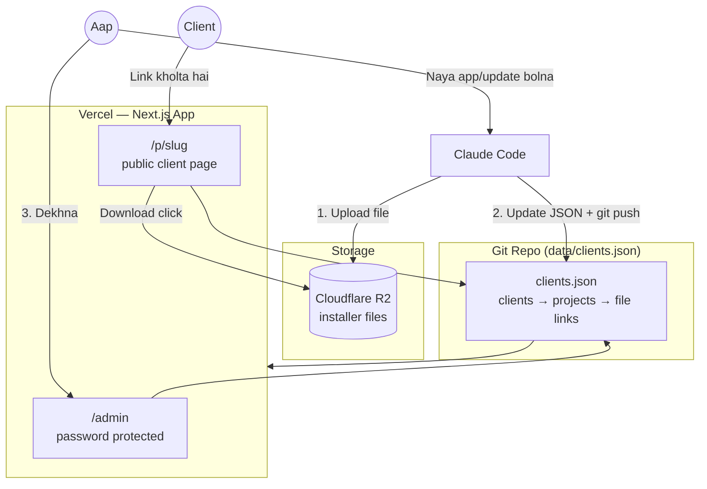
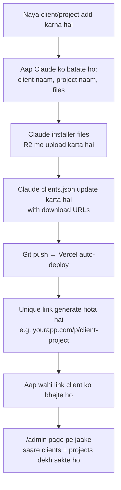
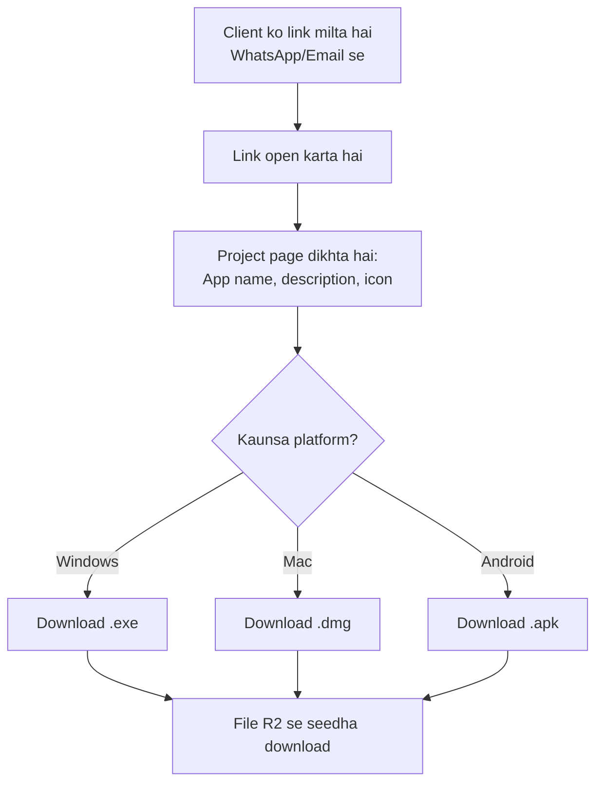
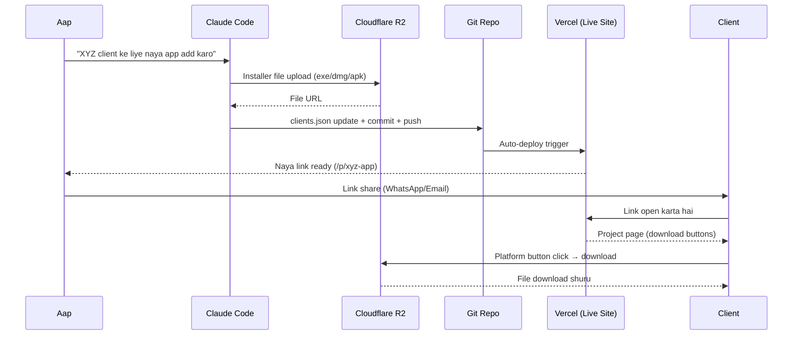

# App Distribution Portal — Plan

## Problem
Abhi apps Google Drive se share ho rahe hain — unprofessional lagta hai, links messy hote hain, aur multiple clients/projects track karna mushkil hai.

## Goal
Ek professional web portal jaha:
- **Admin (aap)** ek jagah se saare clients aur unke projects dekh sake.
- Har **project** ka apna unique link ho, jisme Windows / Mac / Android ke liye direct download buttons ho.
- Client sirf apna link kholega — koi login nahi, seedha download.
- Naya app ya update daalna easy ho (aap bolo → main file R2 pe daalu → link ready).

## Tech Stack
| Part | Choice | Why |
|---|---|---|
| Hosting (website) | Vercel (Next.js) | Free, auto-deploy on git push |
| File storage | Cloudflare R2 | 10GB free, free egress (bandwidth), unlimited apps within size |
| Data | `data/clients.json` in repo | Simple, version-controlled, no DB needed for this scale |
| Admin access | Password-protected `/admin` route | Sirf aap dekh sako saari client list |
| Client access | Secret link `/p/[projectSlug]` | No login, link hi password hai |

---

## Architecture



---

## Admin Flow



## Client Flow



---

## End-to-End Sequence (New App Added → Client Downloads)



---

## Data Model (`data/clients.json`)

```json
{
  "clients": [
    {
      "id": "client-abc",
      "name": "ABC Traders",
      "projects": [
        {
          "slug": "abc-inventory-app",
          "title": "ABC Inventory App",
          "description": "Inventory management app for ABC Traders",
          "version": "1.2.0",
          "downloads": {
            "windows": "https://r2.example.com/abc/inventory-1.2.0-win.exe",
            "mac": "https://r2.example.com/abc/inventory-1.2.0-mac.dmg",
            "android": "https://r2.example.com/abc/inventory-1.2.0.apk"
          }
        }
      ]
    }
  ]
}
```

---

## Pages / Routes

| Route | Access | Purpose |
|---|---|---|
| `/admin` | Password (env var) | Saare clients + projects ki list, links copy karna |
| `/p/[slug]` | Public (link-based) | Client-facing download page for one project |

---

## Folder Structure

```
Project-Services/
├── data/
│   └── clients.json
├── app/ (or pages/)
│   ├── admin/
│   │   └── page.tsx
│   └── p/
│       └── [slug]/
│           └── page.tsx
├── lib/
│   └── clients.ts   (read/query clients.json)
├── public/
└── plan.md
```

---

## Next Steps
1. Next.js project scaffold karna
2. `clients.json` + read logic banana
3. `/p/[slug]` client download page banana (mobile-friendly, platform auto-detect)
4. `/admin` password-protected list page banana
5. Cloudflare R2 bucket setup + upload script (wrangler/rclone)
6. Vercel pe deploy + env vars set karna
7. Pehla real client/project add karke test karna
