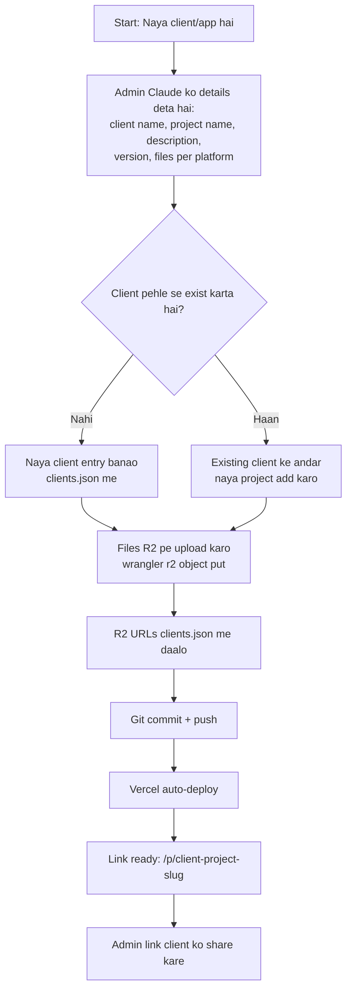
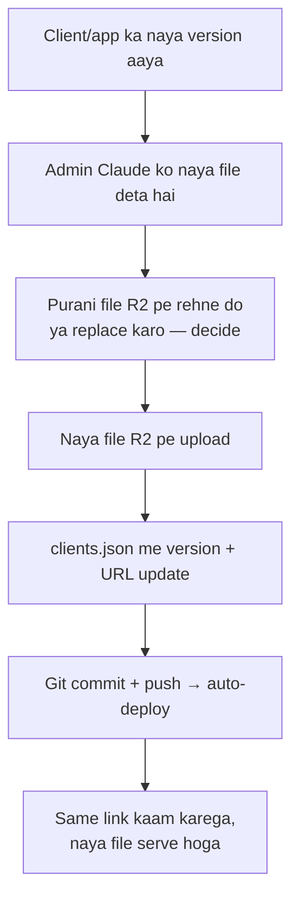
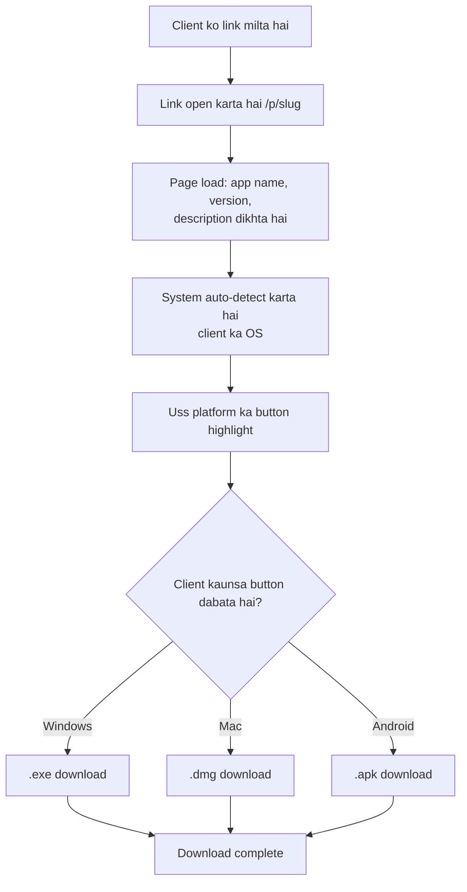
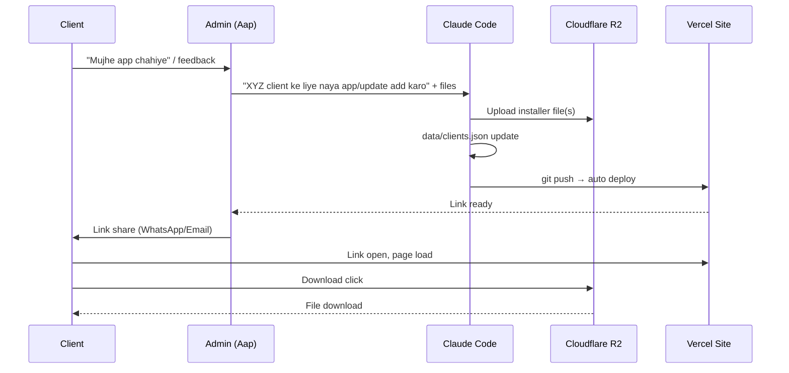

# Workflow Document

## 1. Admin — Add New Client + Project



## 2. Admin — Update Existing App (New Version)



## 3. Client — Download App



## 4. Admin — View All Clients (Dashboard)

```mermaid
flowchart TD
    A[Admin /admin pe jaata hai] --> B{Login session valid?}
    B -->|Nahi| C[/admin/login pe redirect]
    C --> D[Password enter]
    D -->|Sahi| E[Session cookie set]
    B -->|Haan| F[Saare clients + projects list dikhte hain]
    E --> F
    F --> G[Har project ke aage:<br/>link copy button, platforms available]
```

## 5. End-to-End Timeline (Typical Request)


